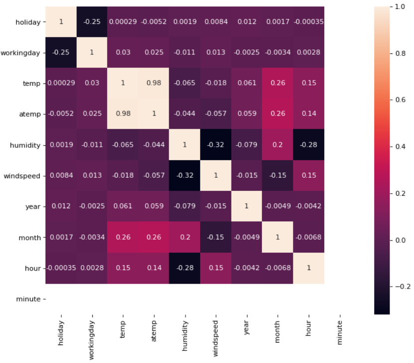
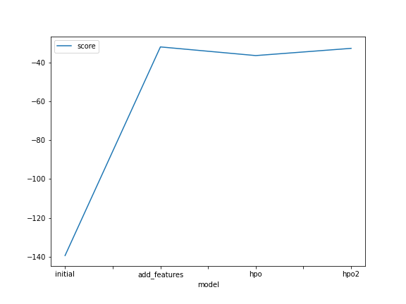
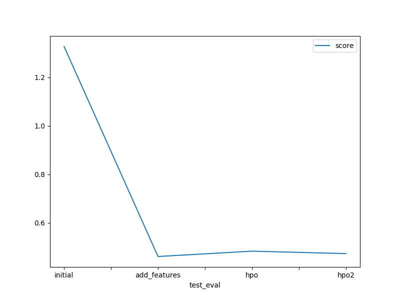

# Report: Predict Bike Sharing Demand with AutoGluon Solution
#### Bruce Kieu

## Initial Training
### What did you realize when you tried to submit your predictions? What changes were needed to the output of the predictor to submit your results?
I used *index=False* agurment in the *to_csv()* method when setting predictions to submission dataframe. I had to remove it to keep the file size of 188kb instead 61.7kb of the *submition.csv*. On the other hand, negative target values *count* were converted to zero before submission

### What was the top ranked model that performed?
Weighted Ensemble L3 is the model that performed well for both adding new features & tuning hyperparameters case 1. Meanwhile, LightGBM_BAG_L1/T51 shows the best for the case 2 of hyperparameter optimization

## Exploratory data analysis and feature creation
### What did the exploratory analysis find and how did you add additional features?
The target feature (*count*) is obviously a strong seasonal variable, by that the following time related features are explored & added:
  Wind, temperature, humidity, register are continuous
  Season and Weather are categorical.
  Holiday and working day are binary values.
  Datetime: year, month, day, hour, minute, weekday.

There are 02 features: *temp & atemp* show a colinearity effect (correlation coefficient is high), either of them need to be removed from the model.

### How much better did your model preform after adding additional features and why do you think that is?
The model's score improve significantly from 1.33 to 0.46 (the less difference from Kaggle result the better), this is because the new features are strongly correlated to the target.

## Hyper parameter tuning
### How much better did your model preform after trying different hyper parameters?
A slight change in the kaggle score, from 0.46 to 0.48) has been found after changing the hyper parameters which is abit worse.  
Another effort on tuning hyperparameters but the score is just abit improve as 0.47, which is not as good as the model params right after adding new features.

### If you were given more time with this dataset, where do you think you would spend more time?
I will spend more time on features engineering and hyper parameter tuning as both are vital processess for building an efficient model

### Create a table with the models you ran, the hyperparameters modified, and the kaggle score.
|model|num_epoch|num_boost_round|time|score|
|--|--|--|--|--|
|initial|default|default|600|1.327|
|add_features|default|default|600|0.461|
|hpo|10|100|600|0.483|
|hpo2|20|200|1200|0.473|

### Create a line plot showing the top model score for the three (or more) training runs during the project.

### Create a line plot showing the top kaggle score for the three (or more) prediction submissions during the project.

## Summary
This is the multivariate regression matter to  predict the bike sharing demand from historical data using the state-of-the-art ML framework - AutoGluon.  
Project as any other data-science project starts from problem statement, EDA, modeling & prediction, and evaluation.  
In order to see how advanced the framework is, the pipeline for serveral models have been created then compared, all in AWS Sagemaker studio.  
  - The initial model was built with the default predictor and the model doesn't perform great.  
  - With Exploratory Data Analysis, assigned right data types for the features and with feature engineering, created new features based on the date time. With the new features, the performance of the model is drastically increased.  
  - Hyper parameter tuning was also done to improve the performance but that did not yield better results as of now. 

The model with new features shew the best performance (obtained a score of 0.461 [RMSE]), it was the final submission to Kaggle.
